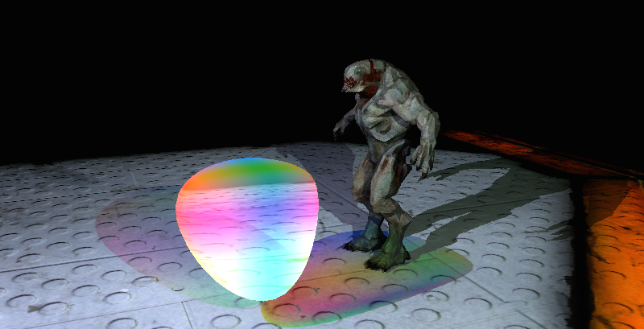
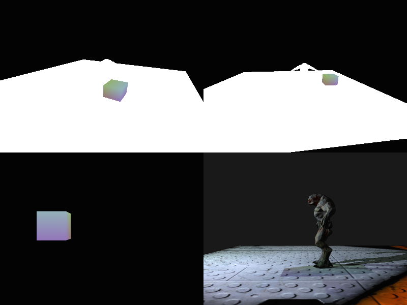
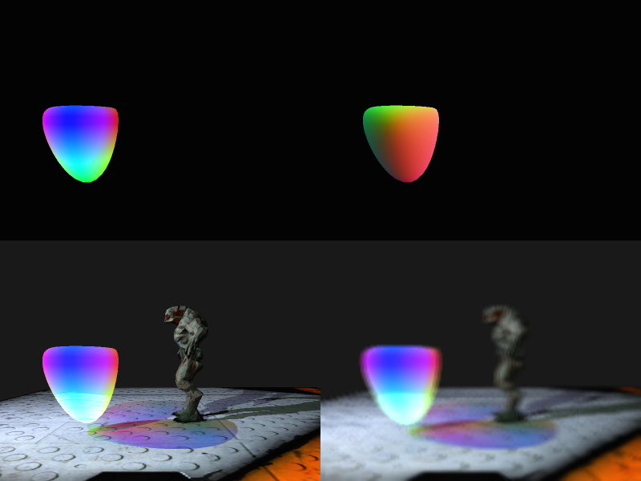
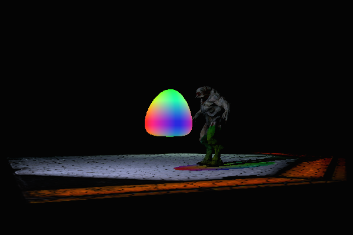
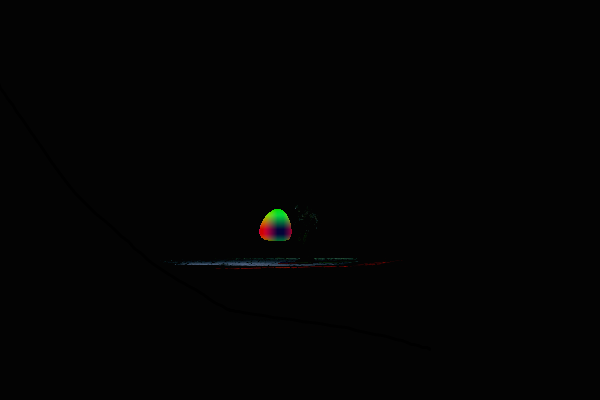

% Graphics Programming with Shaders
% Coursework Documentation for module AG0904A15
% Thomas Hope: 1302495

# Preface

This document is a description of the techniques used for Thomas Hope's submission for module AG0904A15, Graphics Programming with Shaders. The module tutor was Dr Paul Robertson. The application was based on a framework provided by the module tutor written in C++. Shaders were written in HLSL for DirectX11.

# Overview

## Controls
* WASD: forward, left, back, right
* E: up
* Q: down
* Arrow Keys: rotate camera
* NUMPAD 0: show bonus scene
* NUMPAD 1: toggle normal display
* NUMPAD 2: increase tessellation
* NUMPAD 3: decrease tessellation
* NUMPAD 4: show lighting render stages
* NUMPAD 5: show tessellation render stages
* NUMPAD 6: show final scene

## Features
* multiple lights, ambient and diffuse
* per light attenuation
* per light shadow mapping
* per light specular highlights (see bonus scene)
* diffuse texturing
* normal mapping
* tessellation
* transparency
* vertex manipulation
* refraction
* light transmission
* geometry generation
* depth of field
* fog

## Buffers
* Shadow Map x 2
* Scene with light and shadow
* Magic sphere diffuse colours
* Magic sphere normals
* Scene with light and shadow, blended with magic sphere
* Blurred version of the blended scene

## Shaders
* __Depth shader__, renders depth values to texture alpha
* __Texture shader__, renders unlit mesh with texture
* __Shadow shader__, renders objects with light and shadow
* __Normal shadow shader__, renders objects with normal map, light and shadow
* __Tess Colour shader__, renders colour tint and depth to alpha information
* __Tess normal shader__, renders normal information for tessellated shape to texture RGB
* __Blend Shader__, blends two textures with refraction
* __Show Normal Shader__, highlights the edges of faces with a colour representing their normal
* __Blur shader__, modified box blur shader using sub pixel sampling
* __Depth of field shader__, blends a sharp and blurred texture based on depth from the screen centre 

## Objects
### Floor
The scene floor is rendered into shadow maps 1 and 2, so it can receive shadows from the other objects in the scene, and into the lit scene with the shadows and normal maps applied.

### Hellknight Model
The Hellknight is rendered into shadow maps 1 and 2, so it can cast and receive shadows from other objects in the scene, and into the lit scene with shadows and tints applied.

### Magic Sphere
Th magic sphere starts its life as a cube, morphing into a sphere as the tessellation factor is increased. In order for the magic sphere to cast a colour tint, and refract objects behind it it is rendered multiple times. The depth pass writes depth and tint information into the depth buffer, the colour pass renders the diffuse colour, and the normal pass renders the surface normals into another buffer. Essential constructing a normal map for the sphere each frame.

### Bonus Scene
The bonus scene is included to give a more distinct demonstration of some lighting effects. Notably per light specular, attenuation, and range.  

# Detail
## Normal Maps
Normal maps are similar to the usual coloured (diffuse) textures in that they store additional information about the surface they are applied to. However instead of storing colour information they store information about the normal to the surface at each pixel.  
The XYZ direction of the normal is stored as an RGB colour value in tangent space. Tangent space is a coordinate system relative to the surface the normal map is being applied to. In tangent space 'up' is normally represented by the actual normal of the polygon and the other to axes (tangent and binormal) lie on the surface of the polygon perpendicular to each other and the normal.  
This additional tangent and binormal information needs to be passed to the pixel shader somehow, it could be incorporated into the mesh or calculated in a previous shader stage (of which the vertex or geometry shader are the most likely candidates). In the case of the floor I added the tangent and binormal information to the mesh. The normal, tangent and binormal are then multiplied by the worldMatrix in the vertex shader so they are orientated correctly to the surface.  
The normal map is passed into the pixel shader along with the diffuse texture and sampled at the same UV coordinate. The normal sample is then transformed from the range [0,1] to [-1,1], transformed from tangent space, and normalised (if the values in the texture have not been normalised already). All further lighting calculating are then done with this normal.

## Shadow Mapping
Shadow mapping works by rendering the scene from the lights perspective and storing the depth of each pixel in a buffer i.e. the shadow map. The scene is then rendered from the viewers pespective and a test is done for each fragment to see if it's closer or farther away than the corresponding pixel in the lights depth buffer. If the viewer's fragment is closer (after applying a bias to prevent shadow acne) than the that stored in the depth buffer then it is considered lit, if its farther away it is considered unlit.  
In my scene I modified this technique to allow light to appear to pass through semitransparent objects. When storing the depth value in the shadow map I stored the value in the alpha channel and, assuming the object was opaque, set the RGB channels to white. When rendering transparent objects to the shadow map I changed the blend mode before rendering, so the alpha channel would not be modified, writing only the colour that the light should be tinted and preserving the alpha of the object behind.

The top two quarters of the above image show the shadow map for each light. Opaque objects are shown as a white silhouette, their depth information is stored in the alpha channel. The transparent shape is visible in colour and rendered last, keeping the same alpha value as whatever was behind it. The bottom right shows the lit scene with shadows and tints applied, but before the magic sphere/cube has been blended into the scene.  

Below is some pseudo pixel shader code for rendering the shadows with a tint.  

~~~cpp
// Pixel Shader pseudo code

input: ShadowMap
input: light

out: finalColour

// get the projected tex coord in the shadow map
// get depth value by sampling ShadowMap alpha channel
// get tint colour by sampling ShadowMap RGB channel

if( /* ShadMapTexCoord is inside shadow map */ )
{
	// Calculate light depth, adjust with bias to prevent shadow acne

	if( /* the fragment is closed to the light than the sampled depth value */ )
	{
		// the fragment is receiving light
		finalColour = dolighting(light)
		
		// multiply by the tint from the ShadowMap
		// simulates the light passing through it like a filter
		finalColour *= tint

		return finalColour		
	}
	else
	{
		// the fragment is in shadow
		return finalColour = light.ambient
	}
}
~~~

## Magic Sphere
* render colour info with depth to a buffer
* render normals to another buffer
* blend into the scene with depth information, use normals to refract sample

The colour info for the sphere is rendered into the shadow map as described above, and from the viewers perspective into a buffer separate to the main scene with the depth information stored in the alpha channel.

A second pass is done where the normals of the Magic Sphere are calculated in the domanin shader and rendered as colours to a buffer. Creating something akin to a normal.

When blending the Magic Sphere into the scene the alpha channel is sampled to detect if the sphere is visible or obstructed, if the magic sphere is visible then the pixel is blended with the scene behind, otherwise the scene's pixel is returned unmodified. When sampling the scene behind for blending the magic sphere's normal map is used to offset the sample, giving the appearence of refraction.

## Depth Of Field
After the scene is rendered with all lighting and depth stored in the alpha channel the depth of field effect is applied. The final scene buffer is rendered into an downscaled colour buffer using a modified box blur shader. The image below shows the final lit scene in the bottom left, with the blurred version in the bottom right.

The box blur is enhanced by making use of the texture sampler's blending to sample between to pixels. Effectively doubling the number of samples for free.  

The Depth of Field shader then blends between the two buffers by sampling the depth in the centre of the original, then depth at the current pixel, and blending between the blurred and original scene based on the difference between the two depths.

~~~hlsl
// Distance to the center of the screen
centerDist = scene.Sample( Sampler, float2(0.5f, 0.5f) ).w;

// sample the blurred and unblurred textures
sceneSample = scene.Sample( Sampler, input.tex );
blurSample = blur.Sample( Sampler, input.tex );

depthDifference = abs( centerDist - sceneSample.w  ) * 0.9f;

// lerp between the two and apply fog
blendedPixel = saturate(lerp(sceneSample, blurSample, depthDifference));
~~~

Before returning a fog value, multiplied by the distance, is subtracted from the blended pixel. This makes the scene darker / tinted as the camera moves away from objects.

\ 

## Things to improve
There was a problem with the normal mapping where when a light is shining down the negative x or z axis the angle is calculated incorrectly and the light drops off far too fast.  

I tried normal mapping the Hellknight model by calculating the tangents and binormals in the geometry shader using triangle adjacency but because of the way the model data is sent, the adjacent triangles aren't available. In future I could calculate the tangents and binormals on the cpu and bundle them with the vertex data.

# References
1. Dr Paul Robertson, what a gent
2. [RasterTek Tutorials](http://www.rastertek.com/tutdx11.html)
3. [Blur Sampling Trick](http://prideout.net/archive/bloom/)
4. [Normal Mapping](http://www.gamasutra.com/view/feature/129939/messing_with_tangent_space.php)
